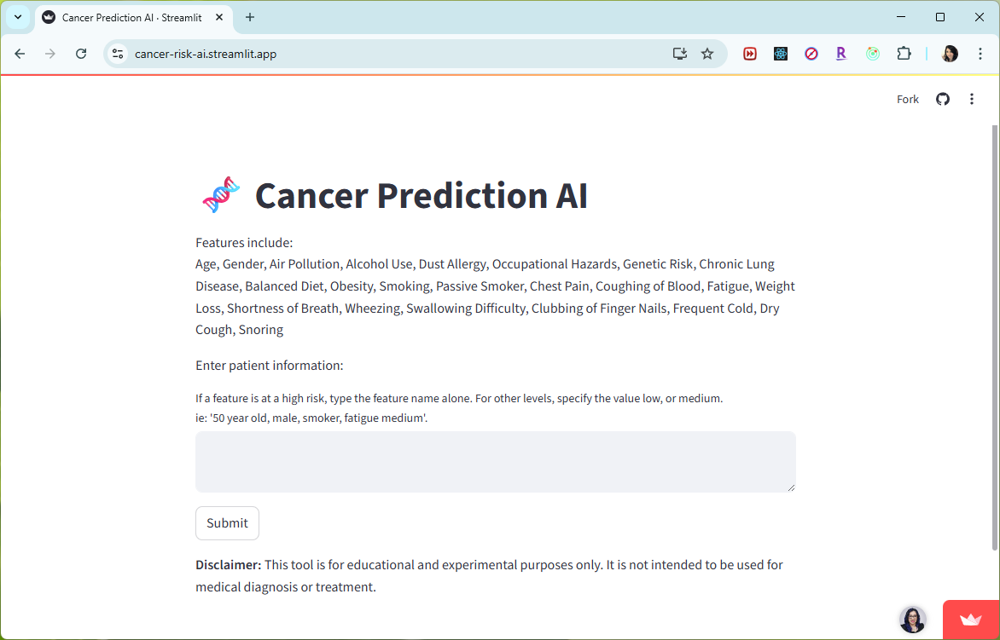
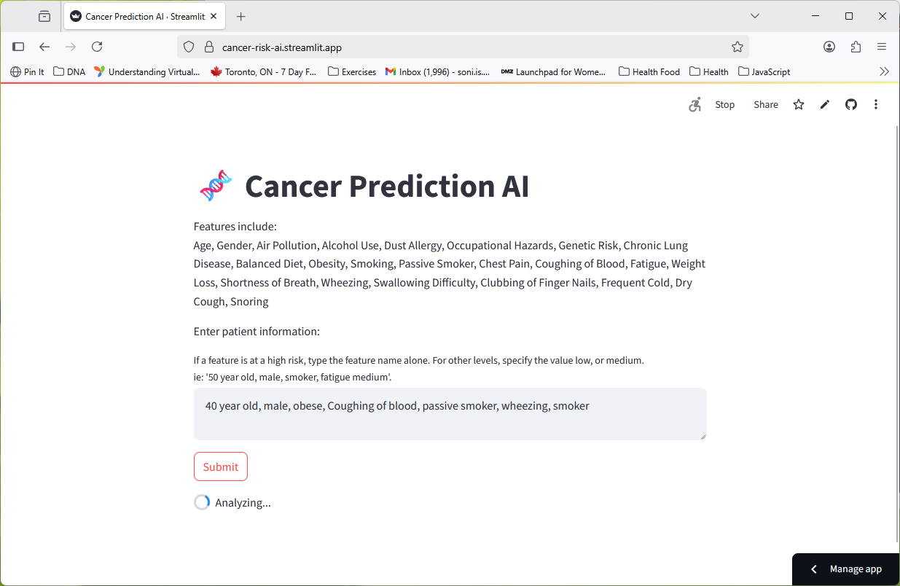
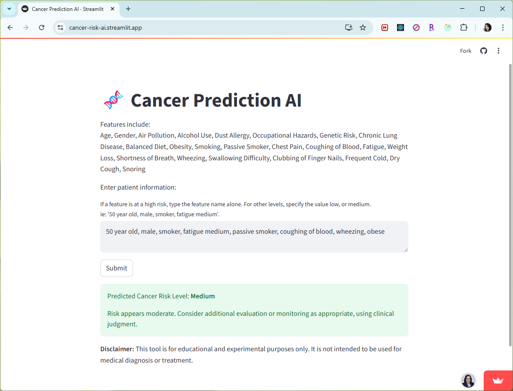
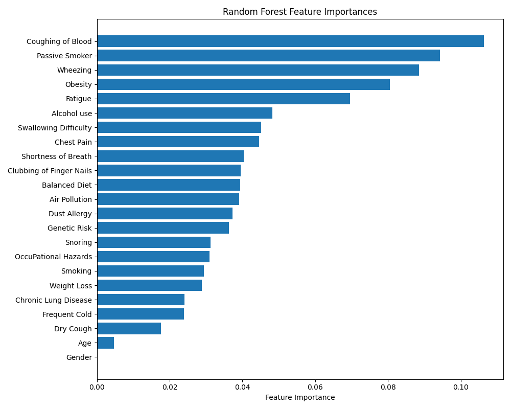

# cancer-risk-ai
 

**Cancer Risk Predictor**

An AI-powered tool that predicts cancer risk based on user-provided patient information. The app uses a machine learning model trained on a real-world dataset and allows users to describe symptoms and risk factors in natural language.

**Overview**

This project allows users to enter health-related details such as age, gender, lifestyle habits, and symptoms. It translates that input into structured features and predicts cancer risk levels: Low, Medium, or High.

The application is built with Python and Streamlit and powered by a Random Forest model trained on publicly available medical data.

**Features**

* Accepts input like:
  "70-year-old male who smokes and has chest pain"
  or
  "Smoking: 7, Passive Smoker is high"
* Supports both descriptive and numeric symptom entries
* Real-time predictions with health insights
* Interactive web interface built with Streamlit
* Clean architecture for further extension or integration

**How It Works**

1. User input is processed and mapped to predefined model features.
2. A trained machine learning model predicts the cancer risk level.
3. An interpretation of the result is provided to support understanding.

**Technologies Used**

* Python
* scikit-learn
* pandas
* joblib
* Streamlit
* Regular expressions (for input parsing)

**Getting Started**

**Prerequisites**

* Python 3.8 or higher
* pip

**Installation**

1. Clone the repository:
   `git clone https://github.com/dimple-dhawan/cancer-risk-ai.git`
   `cd cancer-risk-ai`

2. Install dependencies:
   `pip install -r requirements.txt`

3. Run the app:
   `streamlit run app.py`

Make sure `cancer_model.joblib` and `label_encoder.joblib` are present in the project directory.

**Example Input**
`50 year old, male, smoker, fatigue medium, passive smoker, coughing of blood, wheezing, obese`

**Disclaimer**
This tool is for educational and experimental purposes only. It is not intended to be used for medical diagnosis or treatment.

## Screenshots

<h3>Landing Page</h3>

<h3>Analyzing Request Upon Submit</h3>

<h3>Prediction Result</h3>

## Feature Importance

